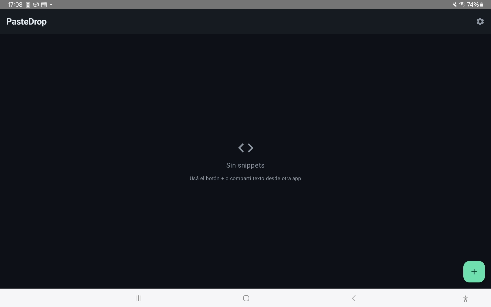
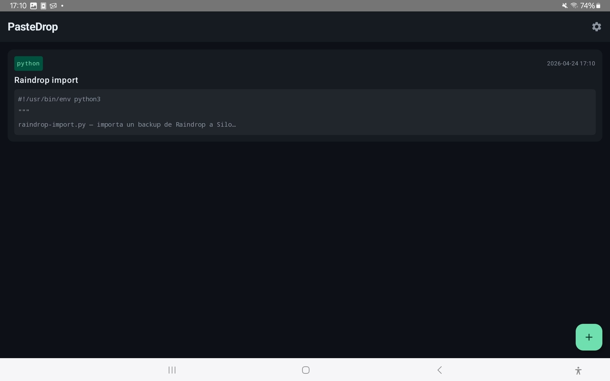
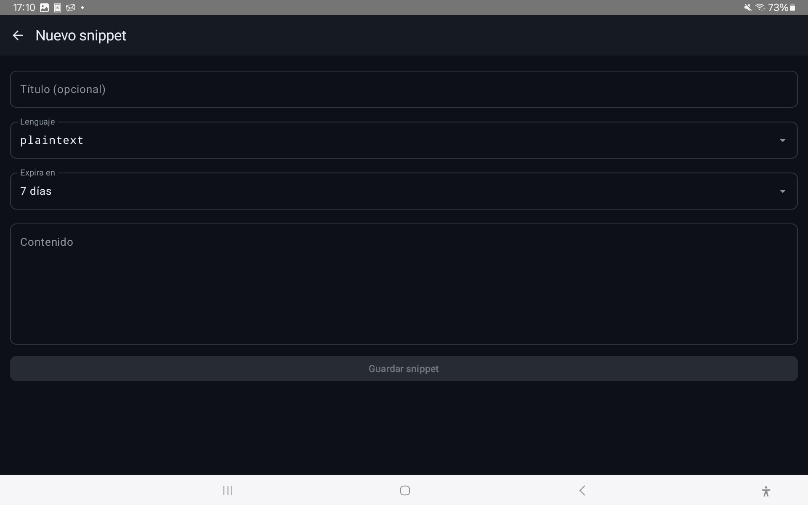
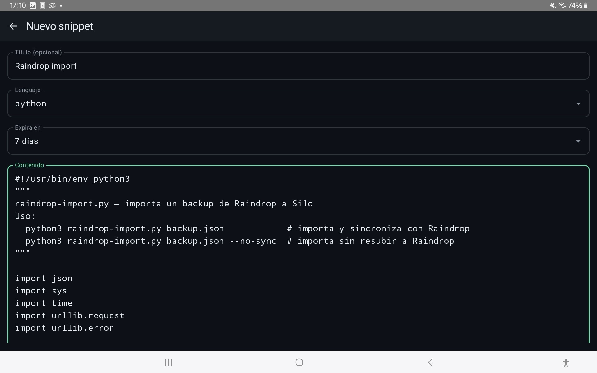
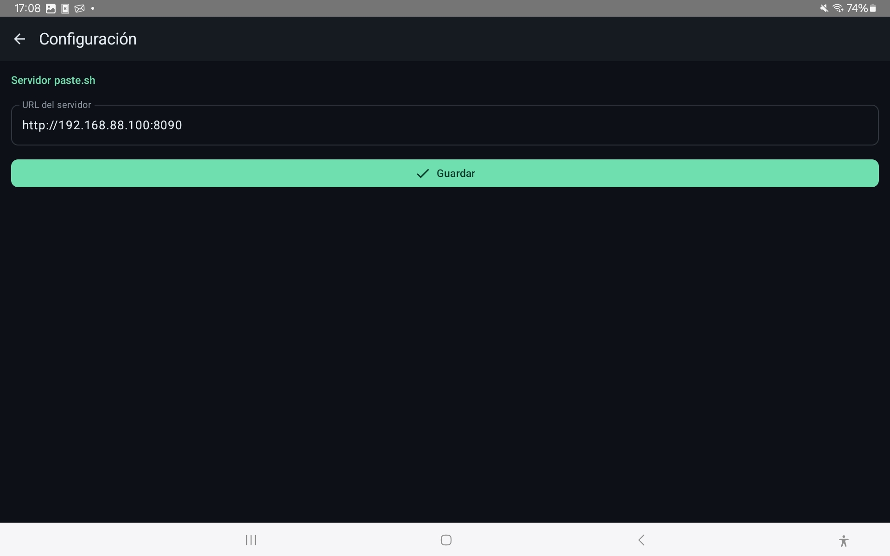

# PasteDrop

App Android para [paste.sh](https://codeberg.org/osdaeg/paste.sh), un pastebin autoalojado. Capturá snippets desde cualquier app y subílos a tu servidor, con soporte offline completo.

## Características

- **Offline-first**: guardá snippets localmente cuando el servidor no está disponible y se sincronizan automáticamente al volver la conexión
- **Menú compartir**: integracion con el sistema de Android — seleccioná texto en cualquier app y compartí a PasteDrop
- **Pull-to-refresh**: trae todos los pastes existentes del servidor
- **Edición en el servidor**: al tocar un snippet podés abrirlo en el browser con el editor completo (CodeMirror 6)
- **Material Design** con tema oscuro

## Capturas







## Requisitos

- Android 8.0 (API 26) o superior
- Servidor [paste.sh](https://codeberg.org/osdaeg/paste.sh) en la red local

## Configuración

Al abrir la app por primera vez, ir a **⚙ Configuración** e ingresar la URL del servidor:

```
http://192.168.88.100:8090
```

## Uso

### Desde la app
Tocá el botón **+** para crear un nuevo snippet. Completá el título (opcional), lenguaje, expiración y contenido.

### Desde el menú compartir
Seleccioná texto en cualquier app → **Compartir** → **PasteDrop**. Se abre el formulario precargado con el texto seleccionado.

### Estados de sincronización
- Sin badge: sincronizado con el servidor
- **Badge rojo** en el título: hay snippets pendientes de sync
- Tag **offline** en la card: ese snippet aún no se subió al servidor

### Editar un snippet
Tocá una card para expandirla → **Editar** — abre el servidor en el navegador con el editor completo donde podés modificar el contenido, lenguaje y expiración.

## Stack

- Kotlin + Jetpack Compose
- Arquitectura MVVM
- Room (base de datos local)
- Retrofit + Moshi (API REST)
- WorkManager (sync en background)
- DataStore (configuración)
- Hilt (inyección de dependencias)

## Estructura

```
app/src/main/java/com/daniel/pastedrop/
├── data/
│   ├── local/       # Room database, DAO, DataStore
│   └── remote/      # Retrofit API, DTOs
├── di/              # Hilt modules
├── domain/
│   ├── model/       # Modelos de dominio
│   └── repository/  # PasteRepository
├── sync/            # SyncWorker, NetworkMonitor
└── ui/
    ├── main/        # Lista principal, formulario
    ├── share/       # ShareActivity (menú compartir)
    ├── settings/    # Pantalla de configuración
    └── theme/       # Material 3 dark theme
```

## Licencia

GPL V3
